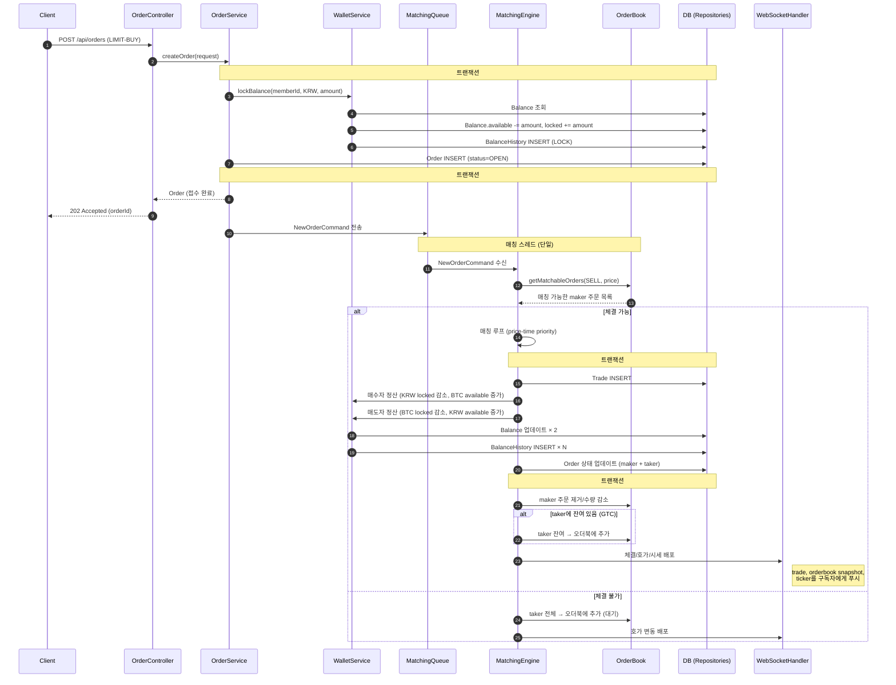
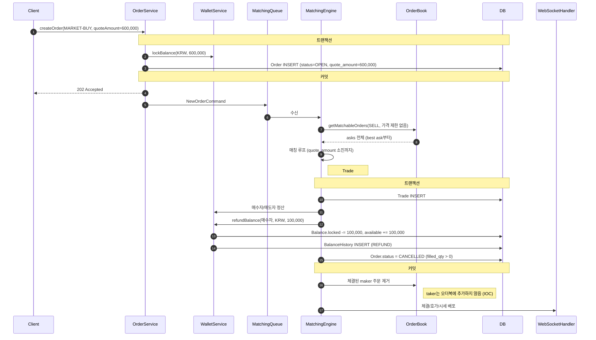
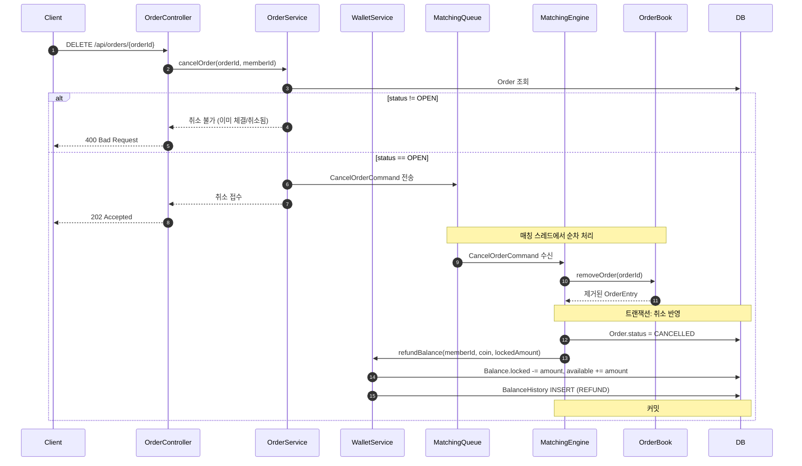
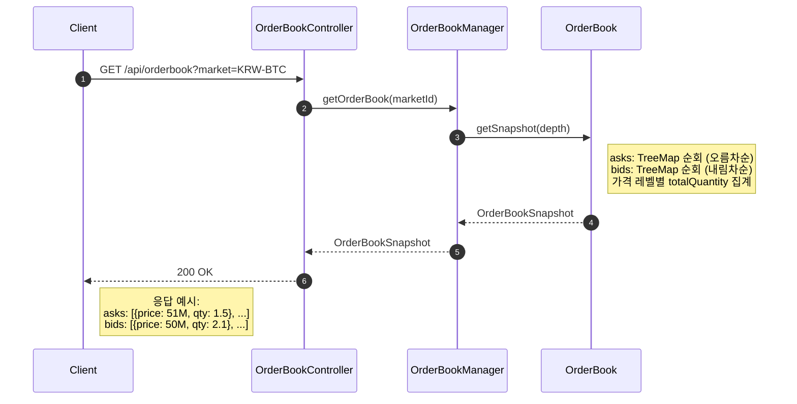
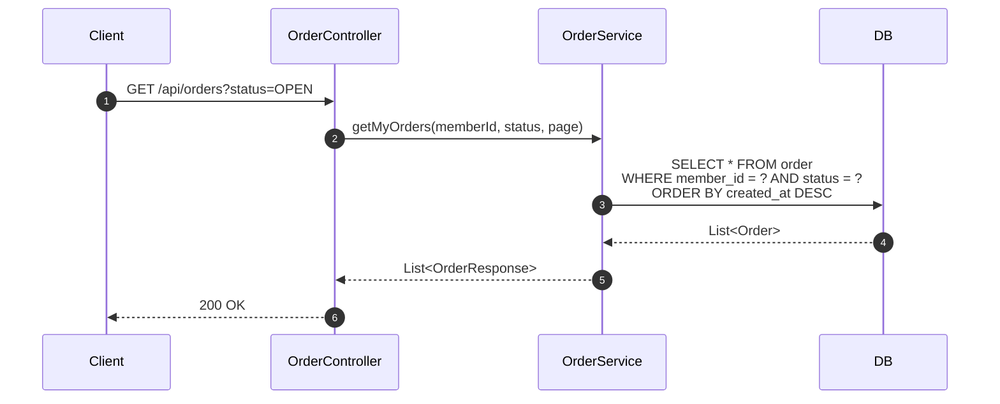
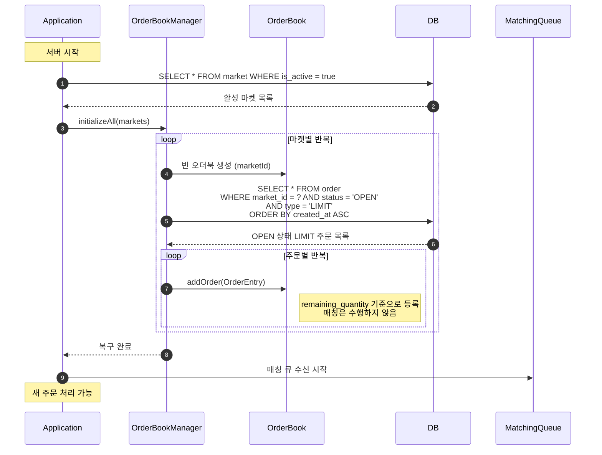
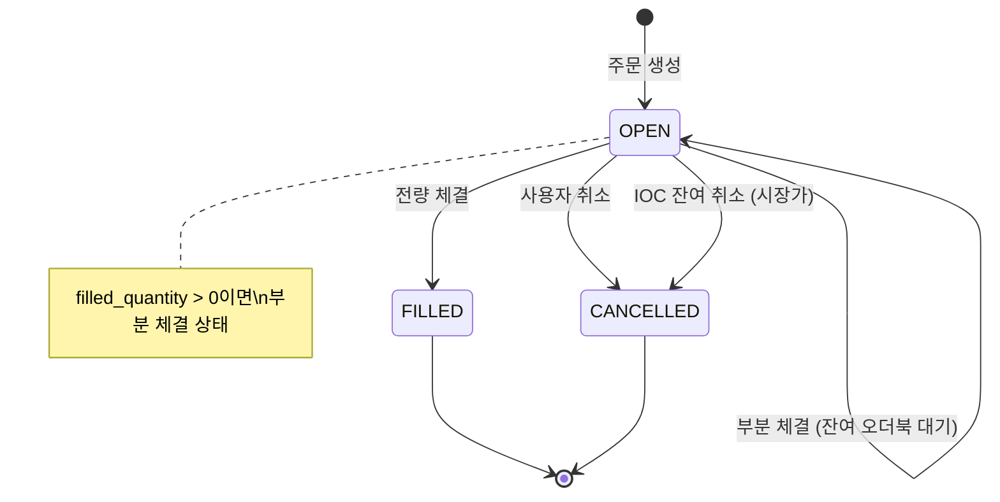
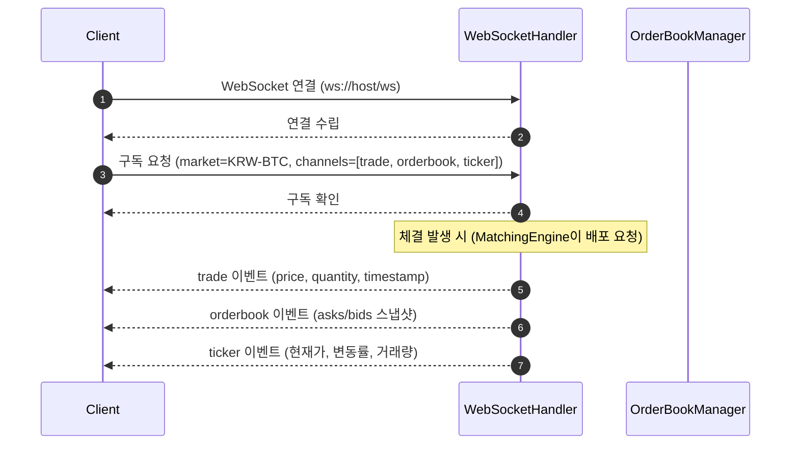
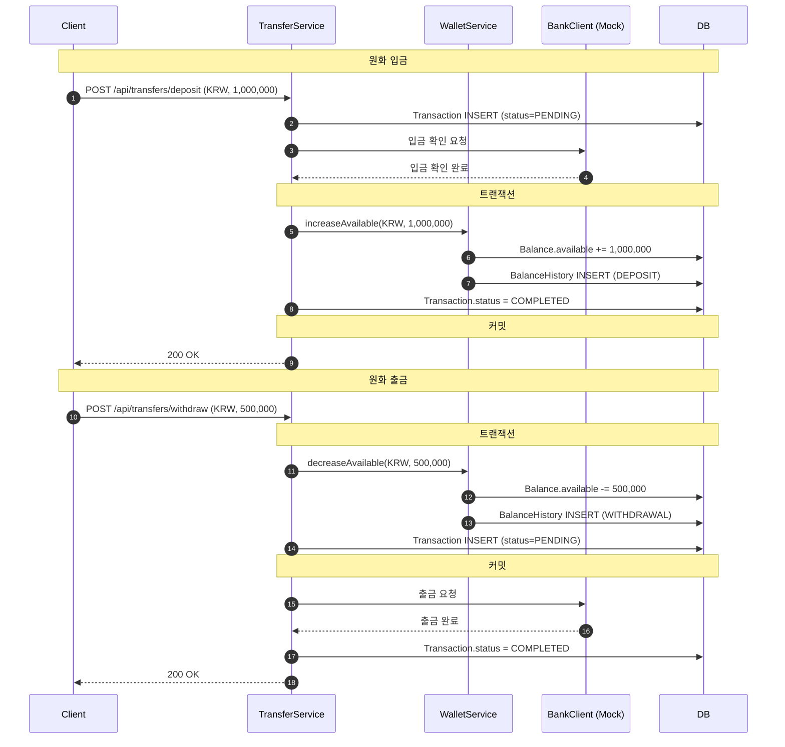

# 핵심 플로우

> 이 문서는 시스템의 **런타임 동작**을 컴포넌트 간 시퀀스 다이어그램으로 보여줍니다.
> 데이터 변화 상세(잔액, 주문 상태)는 [오더북 도메인 모델](../domain/orderbook-domain.md)을 참고하세요.
> 내부 구현 설계는 [오더북 설계](../architecture/orderbook-design.md)를 참고하세요.

---

## 1. 참여자 (Participants)

시퀀스 다이어그램에 등장하는 컴포넌트:

| 참여자 | 레이어 | 역할 |
|--------|--------|------|
| Client | 외부 | API 호출자 |
| OrderController | application | HTTP 요청 수신, 응답 반환 |
| OrderService | application | 유스케이스 오케스트레이션, 트랜잭션 경계 |
| WalletService | application | 잔액 락/언락/정산 |
| MatchingEngine | domain | 매칭 수행, MatchResult 반환 |
| OrderBook | domain | 인메모리 호가창 관리 |
| OrderRepository | domain/system | Order 영속화 |
| TradeRepository | domain/system | Trade 영속화 |
| BalanceRepository | domain/system | Balance 조회/업데이트 |
| MatchingQueue | system | 매칭 요청 큐 (BlockingQueue) |
| WebSocketHandler | system | 실시간 시세/호가/체결 배포 |

---

## 2. 지정가 주문 생성 + 체결

> LIMIT-BUY 주문이 오더북의 기존 SELL 주문과 매칭되는 전체 흐름.
> LIMIT-SELL은 방향만 반대이고 동일한 흐름.



**핵심 포인트:**
- API는 주문 접수(트랜잭션 #1) 시점에 202 응답 → 매칭은 비동기
- 매칭은 트랜잭션 밖에서 수행 (인메모리 연산)
- 체결 결과 반영(트랜잭션 #2)은 매칭 완료 후 원자적으로 처리
- 오더북 업데이트는 트랜잭션 #2 커밋 후에만 실행

---

## 3. 시장가 주문 (IOC)

> MARKET-BUY 주문이 오더북에서 체결되고, 잔여가 반환되는 흐름.
> MARKET-SELL은 quantity 기반인 점만 다르고 동일한 흐름.



**시장가 주문의 차이점:**
- 오더북에 등록되지 않음 (가격이 없으므로 정렬 불가)
- 잔여는 즉시 반환 + CANCELLED (IOC 정책)
- `filled_quantity > 0`이면 부분 체결 후 잔여 취소, `== 0`이면 미체결 취소

---

## 4. 주문 취소

> 사용자가 OPEN 상태의 지정가 주문을 취소하는 흐름.



**핵심 포인트:**
- 취소도 매칭 큐를 통해 처리 → 매칭과 취소의 동시성 문제 방지
- 오더북에서 먼저 제거 후 DB 반영
- 부분 체결된 주문의 취소: `remaining_quantity`만큼만 반환

---

## 5. 오더북 조회

> 마켓의 현재 호가창을 조회하는 흐름. DB를 거치지 않는다.



**핵심 포인트:**
- 인메모리 직접 조회 → DB 쿼리 없음
- 개별 주문이 아닌 **가격 레벨별 집계** 반환 (개인 주문 정보 노출 방지)
- depth 파라미터로 반환할 가격 레벨 수 제한 (예: 상위 15개)

---

## 6. 내 주문 조회

> 사용자 본인의 주문 목록을 조회하는 흐름. 오더북이 아닌 DB에서 조회.



**오더북 조회 vs 내 주문 조회:**

| | 오더북 조회 | 내 주문 조회 |
|---|---|---|
| 데이터 소스 | 인메모리 오더북 | DB (order 테이블) |
| 내용 | 가격 레벨별 집계 (익명) | 본인 주문 상세 |
| 범위 | 마켓 전체 | 본인만 |
| 인덱스 | — | `idx_order_member (member_id, status, created_at)` |

---

## 7. 서버 재시작 복구



**복구 대상:**
- `status = OPEN` + `type = LIMIT`만 복구
- MARKET 주문, FILLED, CANCELLED는 복구하지 않음

**복구 시 매칭을 수행하지 않는 이유:**
- 서버 다운 중 시장 상황이 변했을 수 있음
- 의도하지 않은 체결 방지
- 새 주문이 들어오면 자연스럽게 매칭됨

---

## 8. 주문 상태 전이



**상태 구분:**

| status | filled_quantity | 의미 |
|--------|:-:|------|
| OPEN | 0 | 미체결, 오더북 대기 중 |
| OPEN | > 0 | 부분 체결, 잔여 오더북 대기 중 |
| FILLED | = quantity | 전량 체결 완료 |
| CANCELLED | 0 | 미체결 취소 (사용자 취소 또는 유동성 없는 시장가) |
| CANCELLED | > 0 | 부분 체결 후 취소 (시장가 IOC 잔여 또는 사용자 취소) |

---

## 9. 실시간 시세 구독 (WebSocket)

> 클라이언트가 WebSocket으로 마켓의 실시간 데이터를 구독하는 흐름.



**배포 채널:**

| 채널 | 데이터 | 배포 시점 |
|------|--------|----------|
| trade | 체결가, 체결량, 시각 | 체결 발생 시 |
| orderbook | asks/bids 가격 레벨 스냅샷 | 호가 변동 시 (체결, 주문 추가/취소) |
| ticker | 현재가, 전일 대비 변동률, 24h 거래량 | 체결 발생 시 |

**핵심 포인트:**
- WebSocket은 출력 전용 — 주문 생성/취소는 REST API로 처리
- 매칭 스레드가 체결/오더북 변동 후 WebSocketHandler에 이벤트를 전달
- 구독자가 없어도 매칭 로직에 영향 없음 (느슨한 결합)

---

## 10. 입출금 흐름 (향후 구현 예정)

현재는 테스트용 직접 잔액 충전 API를 사용한다.
입출금 기능 구현 시 아래 흐름으로 전환한다.



---

## 부록: 플로우 간 관계 맵

```
[회원가입/로그인]
       │
       ▼
[입출금] ──── Balance 변동
       │
       ▼
[주문 생성] ──── Balance 락 + Order 저장
       │
       ├── [오더북 등록] (LIMIT-GTC)
       │         │
       │         ▼
       │   [매칭 대기]
       │         │
       │         ├── [체결 발생] ──── Trade 저장 + Balance 정산
       │         │
       │         └── [주문 취소] ──── Balance 언락
       │
       └── [즉시 매칭] (MARKET-IOC)
                 │
                 ├── [체결 발생] ──── Trade 저장 + Balance 정산
                 │
                 └── [잔여 반환] ──── Balance 언락 + CANCELLED
```